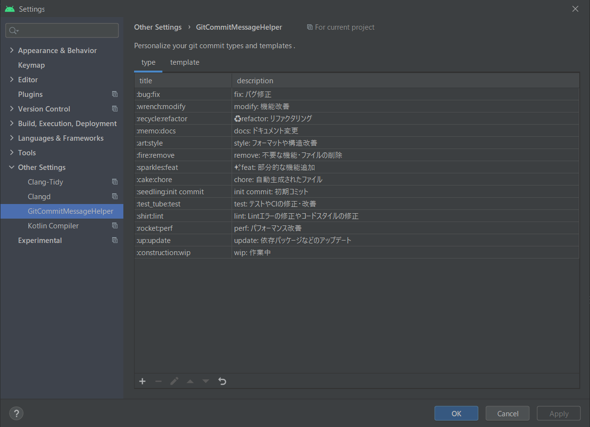

# Android studio templates
Android studioのプロジェクトファイルをGithubにあげる時によく使用するファイルを備忘録的にあげておきます

# テンプレート

## READ.md
[README.md](templates/README.md)<br>
README.mdのテンプレート<br>
Google play storeのURLとアプリ名、簡単な説明、詳細説明を記入
``` markdown
## Google Play Store
https://play.google.com/store/apps/details?id={package id}

## アプリ名

## 簡単な説明

## 詳しい説明
```

## README.md.vm
[README.md.vm](templates/README.md.vm)<br>
Android studioにはApache VelocityでNew fileできるのでそれも作成
- 設定場所は[**Settings**] > [**Editor**] > [**File and Code Templates**]から+で作れる
- **Name**を`README`、**Extension**を`md`、**File name**を`README`にすればREADME.mdを勝手に生成してくれる
- 使用方法は追加したいフォルダ(大体はプロジェクトフォルダ)を右クリック[New] > [README]で自動生成してくれる
  - *Package nameに問題がある場合は適宜変更*
- **※Reformat according to styleのチェックを外さないと2行目がずれる**<br>

```
#[[##]]# Google Play Store
https://play.google.com/store/apps/details?id=com.uchan.${PROJECT_NAME.toLowerCase()}
# id以降は自身の環境に合わせて

#[[##]]# アプリ名

#[[##]]# 簡単な説明

#[[##]]# 詳しい説明
```

## .commit_template
[.commit_template](templates/.commit_template)<br>
GitHubのコミットメッセージのテンプレート
``` markdown
# ==== Emojis ====
# 🐛 :bug:           fix: バグ修正
# 🔧 :wrench:        modify: 機能改善
# ♻ :recycle:       refactor: リファクタリング
# 📝 :memo:          docs: ドキュメント変更
# 🎨 :art:           style: フォーマットや構造改善
# 🔥 :fire:          remove:　不要な機能・ファイルの削除
# ✨ :sparkles:      feat: 部分的な機能追加
# 🍰 :cake:          chore: 自動生成されたファイル
# 🌱 :seedling:      init commit: 初期コミット
# 🧪 :test_tube:     test: テストやCIの修正・改善
# 👕 :shirt:         lint: Lintエラーの修正やコードスタイルの修正
# 🚀️ :rocket:        perf: パフォーマンス改善
# 🆙 :up:            update: 依存パッケージなどのアップデート
# 🚧 :construction:  wip: 作業中


# ==== Format ====
# :emoji:prefix: Subject
#
# Commit body...
```
Android studioでは
```
$git config commit.template {file name}
```
ってやっても出てこない(vimとかには出てくるけど、VCSのコミットダイアログには反映されない)のでPluginsで[Git Commit Message Helper](https://plugins.jetbrains.com/plugin/13477-git-commit-message-helper)を追加して、コミットコメントを登録している
- 登録の仕方は[**Settings**] > [**Other Settings**] > [**GitCommitMessageHelper**]からできる
- Templateも設定できるからそこはお好きなように
- 一括登録とかできたり、別の端末で同じ操作をしたい時は少し不便かなって感じがする……
- あと、何故かdescriptionの絵文字がちょこちょこ消える
<br>

絵文字だけ使いたい人は[Git Commit Guide](https://plugins.jetbrains.com/plugin/16265-git-commit-guide)とかあるし、地味にこのPrefixに使うのオススメって出してくれるから使いやすい<br>
テンプレート登録とかはない

## .gitignore
[.gitignore](templates/.gitignore)<br>
基本はAndroid studioが自動生成する物とか`.jks`ファイル、`google-services.json`をはじく<br>
念のため`.aab`も弾いてる<br>
`.idea/`は正直なくても何とかなるよなって気がするけど、どっちでもいいかって意味で細かくははじいてない
```
# 自動生成
*.iml
.gradle
/local.properties
/.idea/caches
/.idea/libraries
/.idea/modules.xml
/.idea/workspace.xml
/.idea/navEditor.xml
/.idea/assetWizardSettings.xml
.DS_Store
/build
/captures
.externalNativeBuild
.cxx
local.properties

# built application files
*.apk
*.ap_
*.aab

# files for the dex VM
*.dex

# Java class files
*.class

# generated files
bin/
gen/

# Ignore gradle files
.gradle/
build/

# Local configuration file (sdk path, etc)
# local.properties

# Proguard folder generated by Eclipse
proguard/

# Eclipse Metadata
.metadata/

# Mac OS X clutter
*.DS_Store

# Windows clutter
Thumbs.db

# Intellij IDEA (see https://intellij-support.jetbrains.com/entries/23393067)
.idea/workspace.xml
.idea/tasks.xml
.idea/datasources.xml
.idea/dataSources.ids

# 追加
app/google-services.json
*.jks
```

## おまけ(テンプレートじゃないけど)
### proguard-rules.pro
[proguard-rules.pro](templates/proguard-rules.pro)<br>
難読化すると問題がある場合
`app/`にproguard-rules.proを設置して`app/build.gradle`に
``` gradle
# {flavor} は release とか debug とかビルドタイプを記入
android {
  buildTypes {
    {flavor} {
      minifyEnabled true
      proguardFiles getDefaultProguardFile('proguard-android-optimize.txt'), 'proguard-rules.pro'
      
      # shrinkResourcesは重複リソースを結合してくれる
      shrinkResources true
    }
  }
}
```
を記載する必要あり

``` pro
# Gson使っている場合
# dataクラスをJson変換するとおかしくなるため
-keepnames class com.sample.path.* { *; }

# Firebase Crashlytics使ってる場合
# consoleで行数やクラス名が難読化のままで見づらいため
-keepattributes SourceFile,LineNumberTable
```
