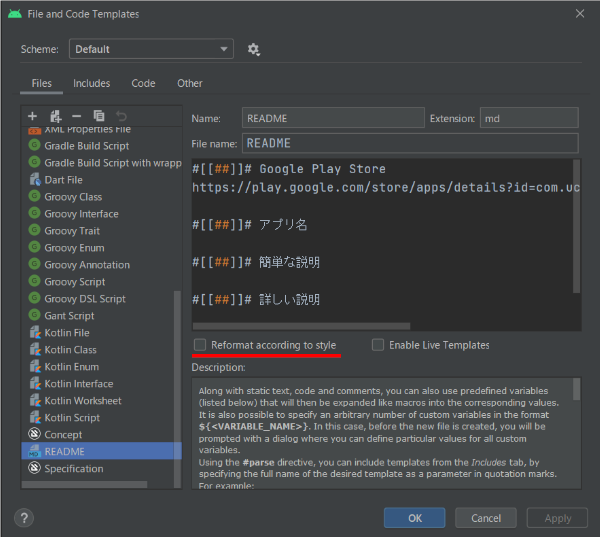

# Android studio templates
Android studioのプロジェクトファイルをGithubにあげる時によく使用するファイルを備忘録的にあげておきます

# テンプレート
## READ.md
[README.md](templates/README.md) 
README.mdのテンプレート 
Google play storeのURLとアプリ名、簡単な説明、詳細説明を記入
## README.md.vm
[README.md.vm](templates/README.md.vm) 
Android studioにはApache VelocityでNew fileできるのでそれも作成
- 設定場所は[Settings] > [Editor] > [File and Code Templates]から+で作れる
- 使用方法は追加したいフォルダ(大体はルート)右クリック[New] > [README]で自動生成してくれる
  - Package nameに問題がある場合は適宜変更
- **※Reformat according to styleのチェックを外さないと2行目がずれる** 

  
ソース

  https://github.com/blue928sky/AndroidStudioTemplats/blob/ee45db4a9f5f7008bc4a399e666afb6087b956aa/templates/README.md.vm#L1-L8

## .commit_template
[.commit_template](templates/.commit_template) 
GitHubのコミットメッセージのテンプレート
